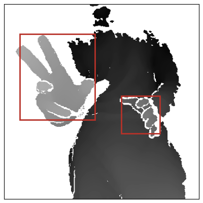
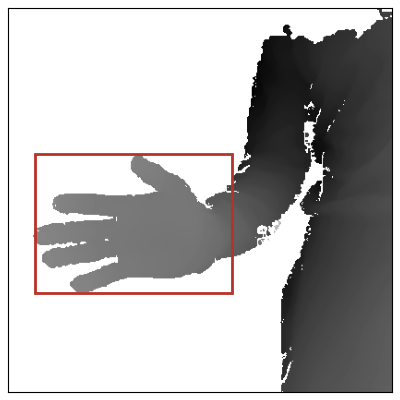
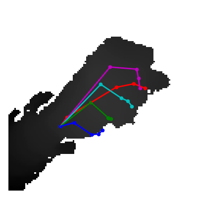
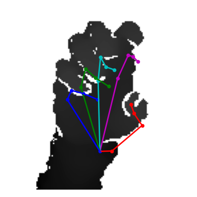
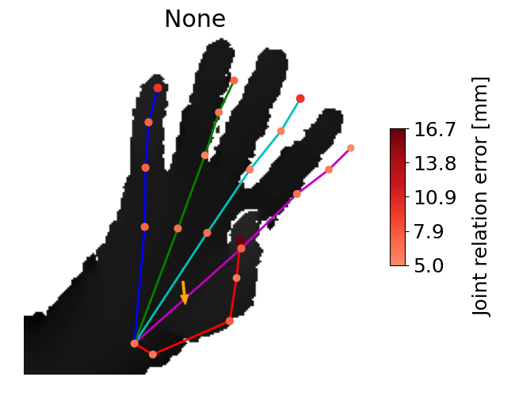

# Gesture recognition system
Author: Ladislav Ondris

This project performs gesture recognition from depth images. 
It consists of hand detection, hand pose estimation, and gesture classification.
Hands are detected using a Tiny YOLOv3 model.
The gesture recognition system then uses a JGR-P2O hand pose estimator
to determine the hands' skeleton, which is used for gesture classification.


## Prerequisites

Python 3.7.10  
Intel RealSense depth camera (e.g., SR305) - only for live capture

## Installation

Install the required packages with:  
```pip install -r requirements.txt```

Install gast==0.3.3, which downgrades the package from version 0.4.0.
TensorFlow has a wrong dependency. It may otherwise print warnings and not function properly.  
`pip install gast==0.3.3`

## Usage examples

### Hand detection

To detect hands from images captured with SR305 camera, which is the default camera:  
`python3 detect.py --source live --num-detections 2`

<p float="left">
    
    
</p> 

```
usage: detect.py [-h] [--camera CAMERA] [--plot PLOT]
                 [--num-detections NUM_DETECTIONS]
                 source

positional arguments:
  source                The source of images (allowed options: live, dataset)

optional arguments:
  -h, --help            show this help message and exit
  --camera CAMERA       The camera model in use for live capture (default:
                        SR305)
  --plot PLOT           Whether to plot the result of detection (default:
                        true)
  --num-detections NUM_DETECTIONS
                        The maximum number of bounding boxes for hand
                        detection (default: 1)
```

### Hand pose estimation

To estimate hand poses from images captured with SR305 camera:  
`python3 estimate.py --source live`

<p float="left">
    
    
</p>

```
usage: estimate.py [-h] [--camera CAMERA] [--plot PLOT] source

positional arguments:
  source           The source of images (allowed options: live, dataset)

optional arguments:
  -h, --help       show this help message and exit
  --camera CAMERA  The camera model in use for live capture (default: SR305)
  --plot PLOT      Whether to plot the estimation (default: true)
```

### System's usage

The system requires that the user defines the gesture to be recognized, which
is performed in *Preparation of gesture database*. The real-time recognition 
from live images or from the custom dataset is demonstrated in 
*Real-time gesture recognition*.

#### Preparation of gesture database

To capture a gesture with label `1` into a `gestures` directory with a scan
period of one second and SR305 camera:  
```python3 database.py --dir gestures --label 1 --scan-period 1 --camera SR305```

```
usage: database.py [-h] [--scan-period SCAN_PERIOD] [--camera CAMERA]
                   [--plot PLOT]
                   directory label

positional arguments:
  directory             The name of the directory that should contain the
                        user-captured gesture database
  label                 The label of the gesture that is to be captured

optional arguments:
  -h, --help            show this help message and exit
  --scan-period SCAN_PERIOD
                        Intervals between each capture in seconds (default: 1)
  --camera CAMERA       The camera model in use for live capture (default:
                        SR305)
  --plot PLOT           Plot the captured poses - recommended (default: true)
```

#### Real-time gesture recognition

To start the gesture recognition system using gesture database stored in 
the `gestures` directory:  
`python3 recognize.py --source live --dir gestures --error-threshold 120 --orientation-threshold 60 --camera SR305`

To start the gesture recognition from the evaluation dataset:  
`python3 recognize.py --source dataset --dir gestures --error-threshold 120 --orientation-threshold 60 --camera SR305`

**For demonstration**, a directory named "test" is already present,
containing definitions for a gesture with opened palm with fingers outstretched
and apart.  
`python3 recognize.py --source live --dir test --error-threshold 120 --orientation-threshold 60 --camera SR305`

The system plots figures similar to the following:  
<p float="left">
    
    
</p>

```
usage: recognize.py [-h] [--error-threshold ERROR_THRESHOLD]
                    [--orientation-threshold ORIENTATION_THRESHOLD]
                    [--camera CAMERA] [--plot PLOT]
                    [--plot-feedback PLOT_FEEDBACK]
                    [--plot-orientation PLOT_ORIENTATION]
                    dir source

positional arguments:
  dir                   The name of the directory containg the user-captured
                        gesture database
  source                The source of images (allowed options: live, dataset)

optional arguments:
  -h, --help            show this help message and exit
  --error-threshold ERROR_THRESHOLD
                        The pose threshold (JRE threshold)
  --orientation-threshold ORIENTATION_THRESHOLD
                        The orientation threshold in angles (maximum: 90,
                        default: 90)
  --camera CAMERA       The camera model in use for live capture (default:
                        SR305)
  --plot PLOT           Whether to plot anything.
  --plot-feedback PLOT_FEEDBACK
                        Whether to display the colorbar with JRE errors
  --plot-orientation PLOT_ORIENTATION
                        Whether to display a vector depicting the hand's
                        orientation
```

### Training of models

To train the Tiny YOLOv3 on the HandSeg dataset:  
```python3 train_yolov3.py```

To train the JGR-P2O model on the Bighand dataset from existing weights:  
`python3 train_jgrp2o.py --train bighand --model logs/20210426-125059/train_ckpts/weights.25.h5`

See --help for other allowed options.

### Evaluation of models

To evaluate the trained JGR-P2O model on the MSRA dataset:  
`python3 src/estimation/evaluation.py --dataset msra --model logs/20210421-221853/train_ckpts/weights.22.h5 --features 128`

See --help for other allowed options.

## Project structure

### Top-level structure

    .
    ├── datasets                # Datasets (including gesture database)
    ├── docs                    # Documentation files 
    ├── src                     # Source files
    ├── LICENSE                 # MIT license
    ├── README.md               # Contents of this file
    ├── requirements.txt        # Package requirements 
    └── upload_ibt_src.sh       # Script for uploading source files to metacentrum

### Datasets

    datasets
    ├── bighand                     # Hand pose estimation dataset (not preprocessed)
    ├── cvpr15_MSRAHandGestureDB    # Hand pose estimatino dataset (is preprocessed)
    ├── handseg150k                 # Hand segmentation dataset (both hands)
    ├── simple_boxes                # Generated toy object detection dataset
    ├── custom                      # Created dataset for the evaluation of gesture recognition
    └── usecase                     # Contains gesture databases captured by the user 

### Source files

    src
    ├── acceptance               # Gesture acceptance module (gesture recognition algorithm)
    ├── datasets                 # Dataset related code (pipelines, plots, generation)
    ├── detection                # Detection methods - Tiny YOLOv3, RDF
    ├── estimation               # JGR-P2O estimation model and preprocessing
    ├── metacentrum              # Scripts for training in Metacentrum
    ├── system                   # Access point to gesture recognition system 
    │                              (database_scanner, gesture_recognizer, hand_position_estimator)
    └── utils                    # Camera, logs, plots, live capture, config


## License

This project is licensed under the terms of the MIT license.
